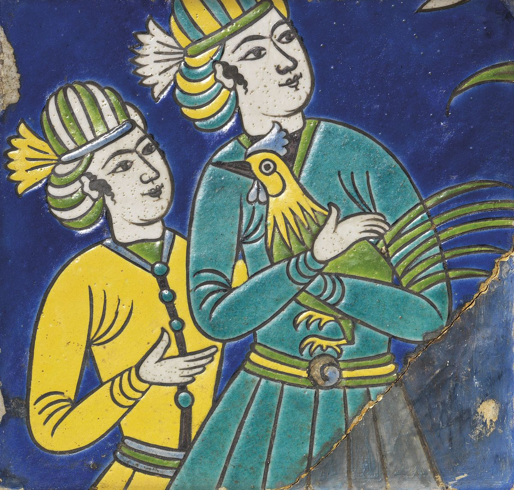

**Hi, I'm a Developer**  

Backend developer. The way I structure code is inspired by Iranian architecture: clear boundaries, indirect connections, and a central core that keeps things stable.

---

